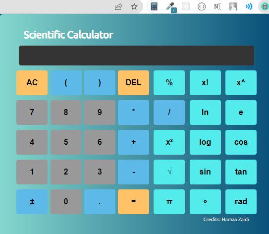

<h1 align="center"> Scientific Calculator Chrome Extension</h1>

# Introduction

Hi! I have made Scientific Calculator which is very helpful some times. If you want to calculate on chrome than this calculator in your extension is useful you can use it anytime!


# ScreenShot



# Installation

- Clone this project:
```

```
- Go to Chrome Extension Webstore
- Go to Extention manager `chrome://extensions/` in chrome
- Load the folder into the chrome

-  **BOOM! YOU ARE NOW LIVE**


